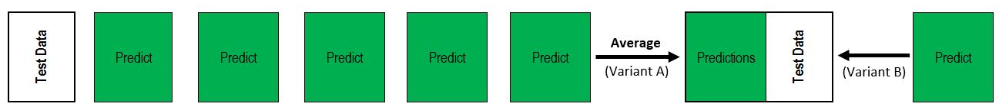
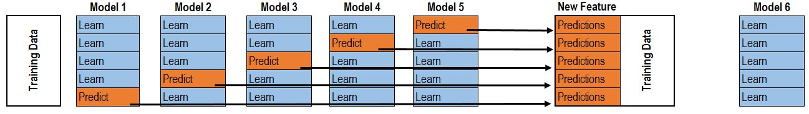
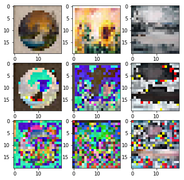
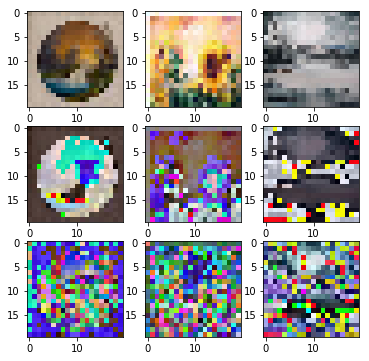
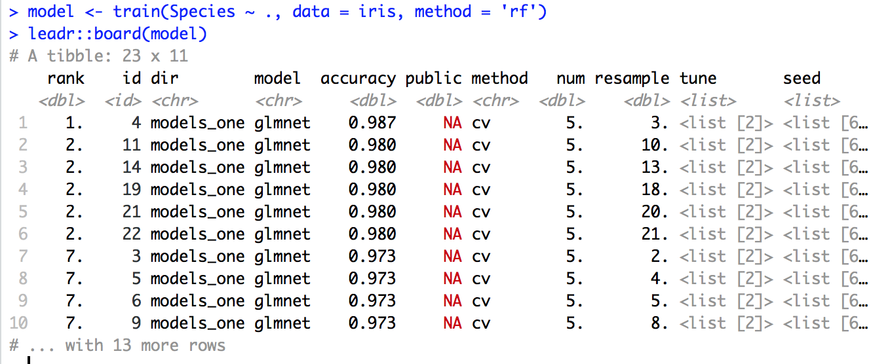

```{r setup, include=FALSE}
knitr::opts_chunk$set(echo = FALSE, warning = FALSE, message = FALSE)
```

## Ensemble Model

- Averaging Ensemble

```{r echo=FALSE}

```

## Ensemble Model

- Averaging Ensemble

```{r echo=FALSE}

```

- Blended Ensemble

```{r echo=FALSE}

```

- https://dnc1994.com/2016/05/rank-10-percent-in-first-kaggle-competition-en/

- ensemble and submodels evaluated on a 30% holdout set
- for final submission, ensemble and submodels trained on entire set

## Model Matrix

- Final model matrix
- .49 10-fold CV
- .5238 public leaderboard

```{r}
library(tidyverse)
as_tibble(readRDS("Contest1/models/norm_stan/pred_train.RDS"))
```


## Base Model Selection

- Base models choosen by two metrics
- maximize 10-fold CV accuracy on 70% training set
```{r echo=FALSE}
library(caret)
list <- readRDS('Contest1/models/norm_stan/model_list_row.RDS')
results <- resamples(list)
summary(results)
```


## Base Model Selection

- Minimize model correlation

```{r echo=FALSE}
splom(results)
```


## Image Preprocessing Selection

- 10-fold cross-validation and correlation selection on preprocessing
    - dataset wide standardization, per image standardization, and correlation filter




## Meta Model Selection

- How to stay organized
    - built R package `leadr` to automatically organize, document, and rank models

```{r eval=FALSE, echo=TRUE}
# install.packages("devtools")
devtools::install_github("tmastny/leadr")
```
```{r echo=FALSE}

```
 